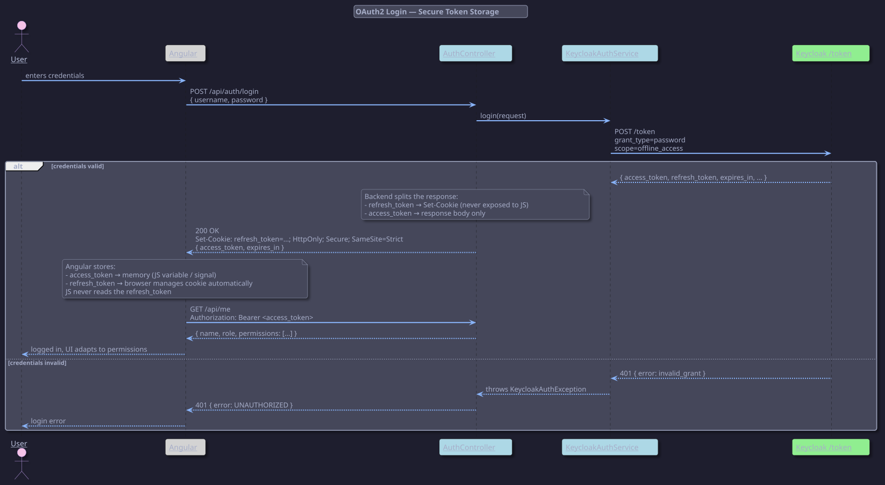
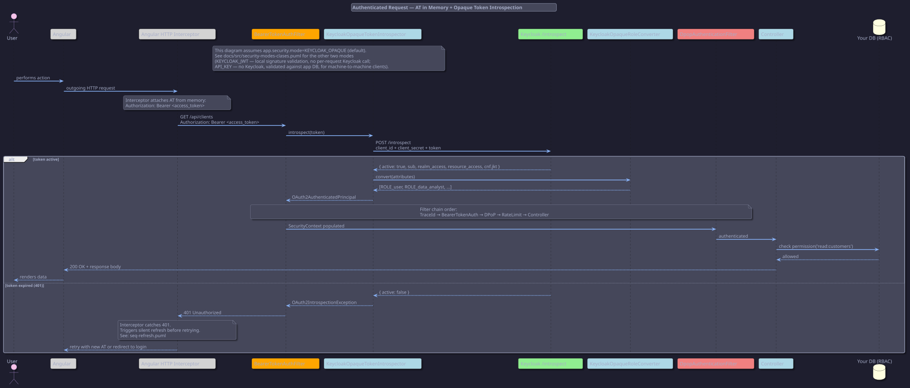
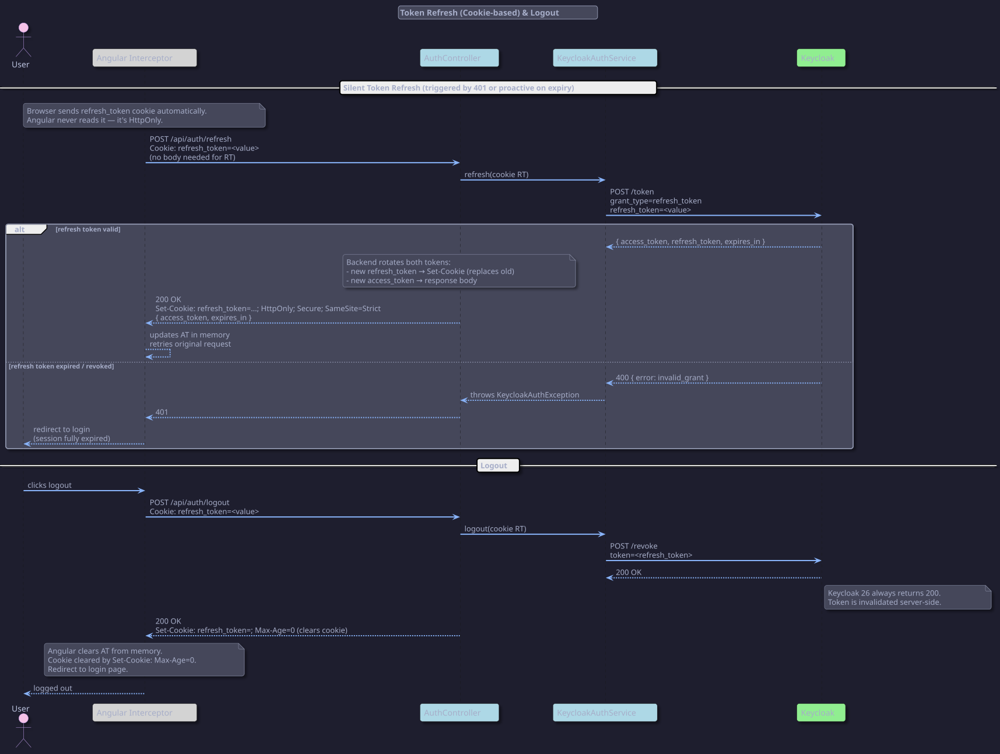
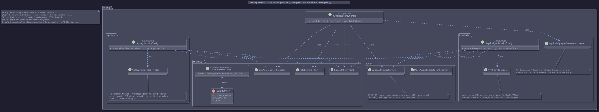
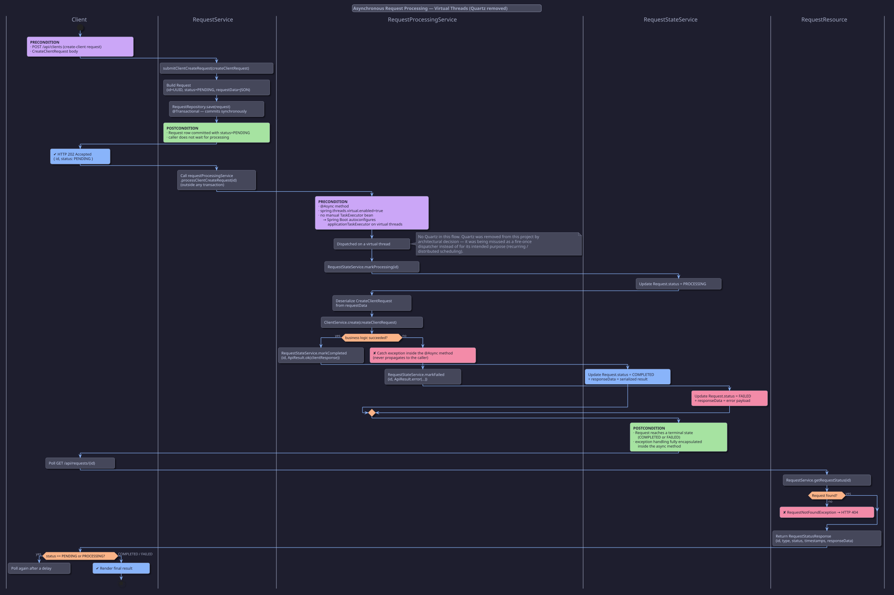
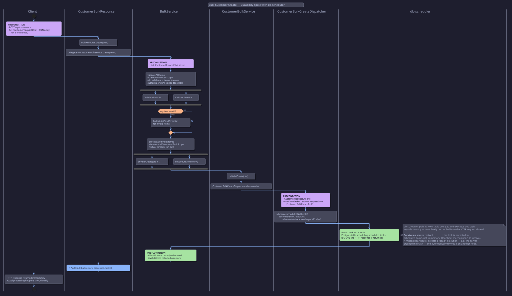
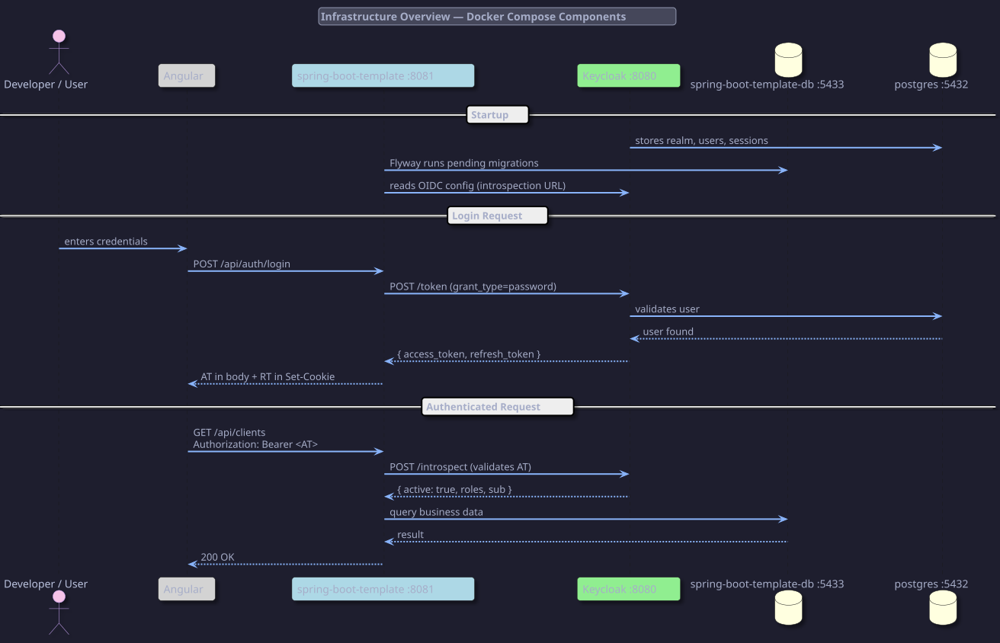

= spring-boot-template
:toc: left
:toc-title: Indice
:toclevels: 3
:icons: font
:sectnums:
:source-highlighter: highlight.js

== Description

Spring Boot 4 / Java 25 template with Postgres and Keycloak: OAuth2 resource server security
(3 selectable modes), async request processing on virtual threads, and a durable bulk-operations
spike backed by db-scheduler.

== Security Architecture

Spring Boot OAuth2 Resource Server with Keycloak as Authorization Server, optional DPoP (RFC 9449),
and secure token storage following OWASP recommendations. See <<Security Modes>> below for the
other two authentication strategies this template supports besides opaque token introspection.

For a beginner-friendly introduction to Keycloak itself, see link:keycloak.adoc[keycloak.adoc].

=== Token Storage Strategy

[cols="1,1,2"]
|===
|Token |Storage |Why

|`access_token`
|JS memory (signal / variable)
|Short-lived. Never persisted. Lost on page refresh → triggers silent refresh via RT cookie.

|`refresh_token`
|HttpOnly cookie (Secure + SameSite=Strict)
|Set by backend via `Set-Cookie`. JS never reads it. Browser sends it automatically on refresh calls.
|===

IMPORTANT: The backend sets the RT cookie directly. The frontend never handles the RT value in JavaScript.
This eliminates XSS exposure of the refresh token entirely.

=== Sequence Diagrams

==== 1. Login Flow

Backend proxies credentials to Keycloak, splits the response: RT goes into a `Set-Cookie` header,
AT goes in the response body. After login, Angular calls `/api/me` to load roles and permissions.

==== 2. Authenticated Request

Angular interceptor attaches the AT from memory. Every request validates the token against
Keycloak `/introspect` in real time. On 401, the interceptor triggers a silent refresh.

Filter chain order:
----
TraceIdResponseHeaderFilter
  → BearerTokenAuthenticationFilter  (opaque token introspection)
    → DpopAuthenticationFilter        (proof validation — optional)
      → RateLimitingFilter
        → Controller
----

==== 3. Token Refresh & Logout

Refresh uses the RT cookie — Angular sends no RT in the body, the browser attaches the cookie automatically.
Backend rotates both tokens and issues a new `Set-Cookie`. Logout revokes the RT in Keycloak and clears the cookie with `Max-Age=0`.

=== Key Design Decisions

[cols="1,2"]
|===
|Decision |Reason

|Opaque tokens over local JWT (default mode)
|Real-time revocation — no stale token window

|Backend sets RT cookie via Set-Cookie
|RT never exposed to JavaScript — eliminates XSS risk on the refresh token

|AT stored in JS memory only
|Not persisted — XSS can read it but only during the session window; short expiry limits damage

|`/api/me` for roles and permissions
|Decoupled from login response; reusable; roles live in app DB not in the token

|DPoP (RFC 9449)
|Sender-constrained tokens — stolen AT unusable without the client's private key

|RBAC lives in app DB
|Business roles and permissions are domain logic — Keycloak only provides identity
|===

== Security Modes

`app.security.mode` (`SecurityMode` enum, `SecurityProperties`) selects one of three
`@ConditionalOnProperty`-gated `@Configuration` classes, each building its own
`SecurityFilterChain`. Default is `KEYCLOAK_OPAQUE`.

[cols="1,2,1,1", options="header"]
|===
|Mode |Validation mechanism |Revocation |Requires Keycloak

|`KEYCLOAK_OPAQUE` (default)
|`KeycloakOpaqueTokenIntrospector` — calls Keycloak `/introspect` on every request
|Immediate
|Yes

|`KEYCLOAK_JWT`
|`NimbusJwtDecoder` — validates the JWT signature locally against Keycloak's JWK set
|Only on token expiry (no per-request call)
|Yes

|`API_KEY`
|`ApiKeyAuthenticationFilter` — validates against API keys persisted in the `security` DB schema
|Immediate (DB-backed)
|No — for machine-to-machine clients
|===

All three modes share `RateLimitingFilter`, `JsonAuthEntryPoint` / `JsonAccessDeniedHandler`,
stateless sessions, and disabled CSRF. The two Keycloak-backed modes additionally wire
`DpopAuthenticationFilter` / `DpopAwareBearerTokenResolver` (RFC 9449) — `API_KEY` does not use DPoP.

== Asynchronous Processing

Client-create requests are processed off the request thread using Spring's `@Async` on virtual
threads — no Quartz involved (it was removed from this project: it was being misused as a
fire-once dispatcher instead of for its intended purpose of recurring/distributed scheduling).

`RequestService.submitClientCreateRequest` persists a `Request` row (`PENDING`, JSONB payload) and
returns immediately. `RequestProcessingService.processClientCreateRequest` is `@Async` and runs on
a virtual thread — `spring.threads.virtual.enabled=true` plus the absence of a manual `TaskExecutor`
bean makes Spring Boot autoconfigure `applicationTaskExecutor` on virtual threads. The async method
marks the request `PROCESSING`, runs the business logic, then marks it `COMPLETED` or `FAILED` —
all exception handling stays inside the async method and never propagates to the caller. Clients
poll `GET /api/requests/{id}` for the terminal result.

== Bulk Durability (db-scheduler)

`CustomerBulkService` is a durability spike: bulk customer creation is scheduled via
https://github.com/kagkarlsson/db-scheduler[db-scheduler] instead of being processed in-request.

`POST /api/customers` accepts a `Set<CustomerRequestDto>` (a JSON array, not a file upload).
`BulkService.create()` validates every item in parallel with `StructuredTaskScope` (virtual-thread
fan-out). For each valid item, `CustomerBulkService.onValidCreate` calls
`CustomerBulkCreateDispatcher.schedule`, which persists a `OneTimeTask<CustomerRequestDto>` into
the `scheduling.scheduled_tasks` Postgres table *before* the HTTP response is returned.

IMPORTANT: This survives a server restart — the task is persisted in `scheduled_tasks`, not in
memory. db-scheduler polls every 2s and revives "dead" executions after 4 missed heartbeats
(10s interval each).

== Infrastructure

Docker Compose wires the app, Keycloak, and their respective Postgres databases together — Flyway
runs pending migrations on startup and Keycloak imports its realm export.

== Project Tooling

=== rename-project.py

One-shot script that rebrands the template to a new project identity.
Replaces `com.template` (Java package + Gradle group) and `spring-boot-template` (artifact, Docker, Keycloak realm) across every tracked file, then moves the Java package directory via `git mv`.

Works on Linux, Mac, and Windows with Python 3 (stdlib only — no pip install needed).

[source,sh]
----
# Preview — writes nothing
python3 scripts/rename-project.py --package com.acme.billing --name billing-service --dry-run

# Apply
python3 scripts/rename-project.py --package com.acme.billing --name billing-service
----

See link:rename-project.adoc[rename-project.adoc] for the full execution flow, options reference, and post-rename checklist.
